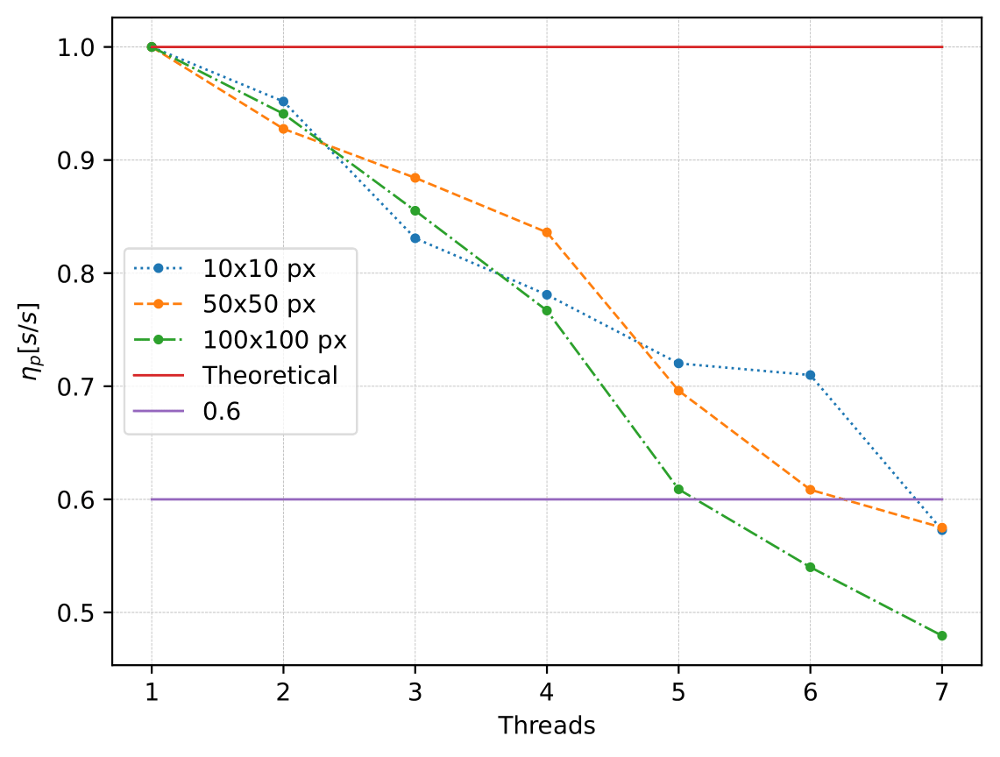

# Modelo de agentes para la generación de residuos en la UN

## Introducción

- [Requerimientos](#requerimientos)

Una simulación modelo de agentes que se propone simular la generación de basura en la Universidad Nacional de Colombia. 

Se desarolla a modo de aplicación un ejecutable donde se observa la evolución en el tiempo de la simualación. En una ventana se observan los agentes que imitan el comportamiento de los residentes de la universidad. Con los patrones de movimiento de los agentes se puede rastrear la generación de basura en las distintas regiones del campus. 

## Programación paralela

La implementación de la palalelización se llevó a cabo mediante dos herramientas. La primera, se trata de la clase [sf::Thread](https://www.sfml-dev.org/documentation/2.5.1/classsf_1_1Thread.php) implementada por SFML. La segunda se hace mediante OpenMP que permite asignar un trabajo a varios threads.

### Uso de threads

En en thread principal se maneja todo lo relacionado con la visualización. También, se inicializa el estado de los agentes. El segundo thread se enfoca en actualizar el estado de los agentes. 

### Uso de OpenMP

Los agentes están contenidos en un array unidimensional el cual se tiene que manipular elemento por elemento para inicializar o actualizar. La lógica consiste en asignarle a cada thread una parte del arreglo tal como lo expresa la Figura ee1. Se le asigna a cada thread el piso de la división entre el número de elementos del arreglo y el número de treads y se le deja al último thread el módulo de la división anterior. Así, se asegura que todas las posición del arreglo sean correctamente repartidas en una asignación contigua.


*Figura ee1. Asignación de array en threads de OpenMP*


### Métricas

#### Speedup 
La manera en la que se determina el speedup:

$$ S(n)=\frac{T(1)}{T(n)} $$

En la Figura ee2 se observa el speedup para la inicialización de los agentes.


*Figura ee2. Speedup al inicializar los agentes.*

En la Figura ee3 se tiene el speedup para la actualización de agentes.


*Figura ee3. Speedup en la actualización de los agentes.*

#### Eficiencia paralela

La eficiencia paralela viene dada por la fórmula:

$$ \eta _p (n)= \frac{S(n)}{n} $$

De manera recíproca, se presentan las Figuras ee4 y ee5 para la eficiencia en paralelo.




*Figura ee4. Eficiencia al inicializar los agentes.*


*Figura ee4. Eficiencia en la actualización de los agentes.*


## Requerimientos
- armadillo This site was built using [Armadillo c++](https://arma.sourceforge.net/download.html)
- [SFML](https://www.sfml-dev.org/): Se usa para la interfaz gráfica y tiene su propia manera de lanzar threads.
- [OpenMP](https://www.openmp.org/): Se utiliza para programar de manera paralela por medio de memoria distribuida.

Descargar la última versión de la rama main del repositor.


### Windows
Utilizar un programa que lea a
```
mingw32-make windowsA
```
donde A puede tomar valores '','2','3' dependiendo de la instalacion de armadillo y blas.
```
mingw32-make windows    #armadillo incluido en path
mingw32-make windows2   #armadillo no incluido -lblas
mingw32-make windows3   #armadillo no incluido -lopenblas
```
### Linux
Para compilar se utiliza el gmake de esta manera
```bash
gmake linux
```
Se lanza especificando el número de threads que se quieran utilizar.

```bash
OMP_NUM_THREADS=$threads ./Dispersion_social.out
```

## Plataformas Utilizadas para el trabajo en equipo
Permite organizar de manera rápida los encuentros.


Facilita la manera de programar en conjunto y llevar un control de versiones.


Se crean salas para interactuar, distintos canales y los mensajes son persistentes.


Permitió compartir archivos.


Se realizaron las primeras reuniones y se grababan las llamadas.


Para editar documentos en formato .tex.


## Hardware
- Para correr la simulación a escala entera (un mapa de 200x200 pixeles) se requiere 16Gb de Ram para que sea estable. Los requerimientos de resoluciones menores aún no se han medido. 
- El proceso más intensivo es el preprocesamiento del mapa, que usa funciones de Madyacencia.h y es la razón del alto consumo de ram.
